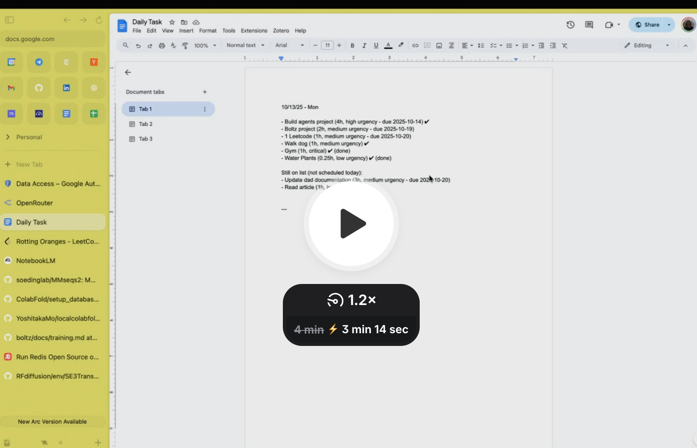
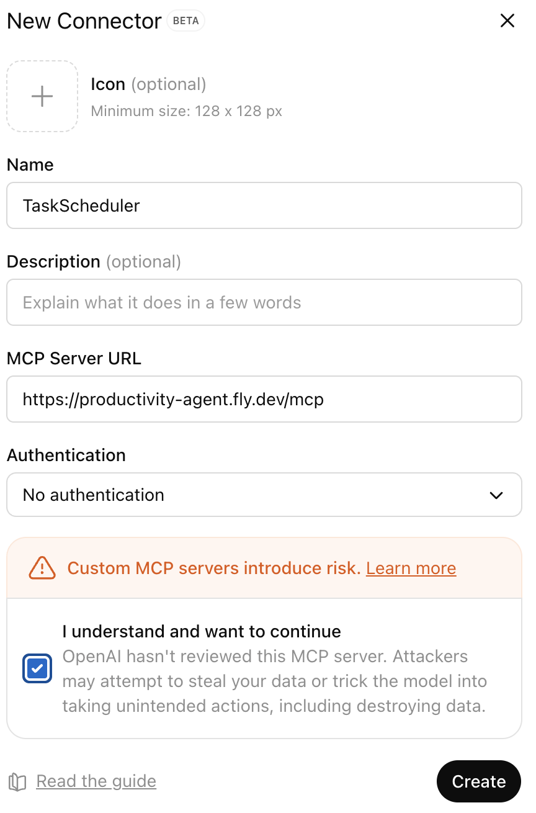

# Productivity Agent
Automatically generates a time-blocked task list for the next day by fetching calendar events, new tasks, and outstanding items, then prioritizing them intelligently.

 ## 🎥 Demo for local client: ##
[](https://www.loom.com/share/50583007198c4e9cabdd7f20f48b3c24)

---
### Option to run this application with: ### 

(1) a ***local CLI client and local server*** (would require OpenRouter API key) or

(2) ***ChatGPT*** -- available for paid users -- as the client and server hosted on fly.io (recommended)

## Option 1: Set up for local CLI client and local server##

Step 1. Create a new project at https://console.cloud.google.com/

Step 2. Enable required APIs (APIs & Services → Library):
   - Google Calendar API
   - Google Docs API
   - Google Drive API

Step 3. Configure OAuth Consent Screen (APIs & Services → OAuth consent screen):
   - Type: External
   - App name: Task Scheduler CLI
   - Add scopes:
     * `https://www.googleapis.com/auth/calendar.readonly`
     * `https://www.googleapis.com/auth/documents`
     * `https://www.googleapis.com/auth/drive.file`
   - Add test users (your Google account email)

Step 4. Create OAuth 2.0 Credentials (APIs & Services → Credentials):
   - Create Credentials → OAuth 2.0 Client ID
   - Type: Web application
   - Authorized redirect URIs: `http://localhost:8084/oauth/callback`
   - Download the JSON file

Step 5. Configure environment variables in `.env`:
   ```bash
   # Extract from downloaded JSON
   GOOGLE_CLIENT_ID=your-client-id.apps.googleusercontent.com
   GOOGLE_CLIENT_SECRET=your-client-secret
   GOOGLE_REDIRECT_URI=http://localhost:8084/oauth/callback
   ```

Step 6. Get OpenRouter API key from https://openrouter.ai/keys

Step 7. Create `client/fastagent.secrets.yaml` with your API key:
   ```yaml
   openrouter:
       api_key: your-openrouter-api-key-here
   ```

Step 8. Update `client/task-scheduler.config.yaml` line 20:
   ```yaml
   url: "http://localhost:8084/mcp"
   ```

Step 9. Start the server:
   ```bash
   python server/task_scheduler_server.py
   ```

Step 10. Complete OAuth authentication:
   - Visit: `http://localhost:8084/oauth/authorize?user_id=default`
   - Grant permissions (tokens saved to `server/data/tokens/default.json`)

Step 11. Run the CLI client:
   ```bash
   python client/task-scheduler-client.py
   ```
Step 12. Ask for your personalized next day task list

## Option 2: Set up for ChatGPT client and fly.io server##

Step 1. Visit https://chatgpt.com/#settings/Connectors 

Step 2. Enable developer mode under 'Advanced settings'

Step 3. Click the 'Create' button at the top right hand corner

Step 4. Fill in the following details 



Step 5. Add 'TaskScheduler' application in the chatbox and ask for your personalized next day task list!
